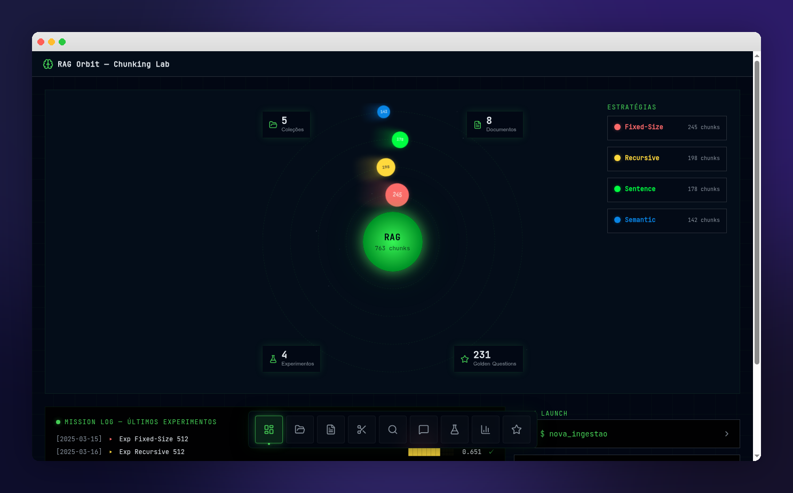

# 🪐 RAG Orbit — Chunking Lab

[](https://react.dev/)
[](https://tanstack.com/start)
[](https://vite.dev/)
[](https://tailwindcss.com/)
[](https://www.typescriptlang.org/)
[](https://bun.sh/)
[]()
[]()

**Plataforma de experimentação e avaliação comparativa de estratégias de chunking para sistemas RAG (Retrieval-Augmented Generation).**

Desenvolvido como parte de dissertação de mestrado.

## 📸 Screenshot



## 👥 Autores

- **Tiago Cardoso Soares**
- **Alan Tulio Lino Gonçalves**

## 📋 Sobre o Projeto

O RAG Orbit é uma plataforma interativa para avaliar o impacto de diferentes estratégias de segmentação de texto (chunking) na qualidade de respostas geradas por sistemas RAG. O projeto utiliza documentos institucionais da EMBRAPII e Currículos Lattes como corpus de teste, comparando cinco estratégias de chunking através de métricas padronizadas do framework RAGAS.

### Motivação

A qualidade de um sistema RAG depende fortemente de como os documentos são segmentados antes da indexação vetorial. Este trabalho investiga experimentalmente qual estratégia de chunking produz os melhores resultados de recuperação e geração para domínios acadêmicos e institucionais brasileiros.

## 🔬 Estratégias de Chunking Avaliadas

| Estratégia | Descrição |
|---|---|
| **Fixed-Size** | Segmentos de tamanho fixo (512 tokens) com sobreposição de 50 tokens |
| **Recursive** | Divisão recursiva por separadores hierárquicos (`\n\n`, `\n`, `. `, ` `) |
| **Sentence** | Segmentação por sentenças completas |
| **Semantic** | Agrupamento por similaridade semântica (percentil 25) |
| **Structure-Aware** | Segmentação que respeita a estrutura do documento (seções, campos JSON) |

## 📊 Métricas RAGAS

| Métrica | O que avalia |
|---|---|
| **Faithfulness** | Fidelidade da resposta ao contexto recuperado |
| **Answer Relevancy** | Relevância da resposta à pergunta feita |
| **Context Precision** | Precisão dos chunks recuperados (relevantes no topo) |
| **Context Recall** | Cobertura — se os chunks contêm a informação necessária |
| **Answer Correctness** | Correção da resposta comparada ao golden answer |
| **MRR** | Mean Reciprocal Rank da recuperação |

## 🖥️ Funcionalidades

- **Dashboard (Solar System)** — Visualização orbital das estratégias com métricas agregadas
- **Coleções** — Gerenciamento de coleções de documentos por estratégia
- **Documentos** — Listagem e inspeção de documentos indexados
- **Chunking Lab** — Comparação visual de estatísticas de chunking (tamanho, distribuição)
- **Busca Semântica** — Interface para testar buscas vetoriais no corpus
- **RAG Chat** — Chat com o sistema RAG para testar respostas
- **Experimentos** — Configuração e execução de avaliações RAGAS
- **Resultados** — Heatmaps, box-plots, radar charts e testes estatísticos (Wilcoxon)
- **Golden Set** — Gerenciamento das 231 perguntas de avaliação (factuais e inferenciais)

## 🛠️ Tech Stack

- **Framework**: [TanStack Start](https://tanstack.com/start) v1 (React 19, SSR)
- **Build**: [Vite](https://vite.dev/) 7
- **Estilização**: [Tailwind CSS](https://tailwindcss.com/) v4
- **Componentes UI**: [shadcn/ui](https://ui.shadcn.com/)
- **Gráficos**: [Recharts](https://recharts.org/)
- **Runtime**: [Bun](https://bun.sh/)

## 🚀 Como Rodar

### Desenvolvimento local

```bash
# Instalar dependências
npm install

# Iniciar servidor de desenvolvimento
npm run dev
```

O servidor estará disponível em `http://localhost:8080`.

### Docker

> Pré-requisito: Docker e Docker Compose instalados.

```bash
# Copiar e configurar variáveis de ambiente
cp .env.example .env
# Edite o .env se necessário (padrão: VITE_API_BASE_URL=http://localhost:8000)

# Subir o container
docker compose up
```

O servidor estará disponível em `http://localhost:8080`.

O código-fonte é montado como volume, portanto alterações nos arquivos refletem automaticamente sem necessidade de rebuild (hot reload ativo).

Para rodar em background:

```bash
docker compose up -d
```

Para parar:

```bash
docker compose down
```

## 📁 Estrutura do Projeto

```
src/
├── components/          # Componentes React reutilizáveis
│   ├── ui/              # Componentes shadcn/ui
│   ├── AppLayout.tsx    # Layout principal com header
│   ├── AppSidebar.tsx   # Sidebar de navegação
│   ├── CommandDock.tsx   # Dock flutuante com efeito magnético
│   ├── SolarSystem.tsx  # Visualização orbital do dashboard
│   ├── MetricBoxPlot.tsx # Box-plot SVG para métricas
│   ├── StatusBadge.tsx  # Badge de status dos experimentos
│   └── StrategyBadge.tsx # Badge colorido por estratégia
├── data/
│   └── mock-data.ts     # Dados simulados para todas as telas
├── lib/
│   ├── types.ts         # Tipos TypeScript (interfaces, enums, constantes)
│   └── utils.ts         # Utilitários (cn, etc.)
├── routes/              # Rotas (file-based routing)
│   ├── __root.tsx       # Root layout (HTML shell)
│   ├── _layout.tsx      # Layout com sidebar
│   └── _layout/         # Páginas da aplicação
├── hooks/               # Custom hooks
└── styles.css           # Tokens de design (tema Matrix Academic)
DOCS/
└── dashboard.md         # Documentação técnica do dashboard
```

## 📝 Corpus de Teste

| Documento | Tipo | Descrição |
|---|---|---|
| Manual de Operação EMBRAPII v6 | PDF | Manual operacional com normas e procedimentos |
| Código de Ética ago/2019 | PDF | Código de conduta ética da EMBRAPII |
| Regimento Comitê de Conduta Ética | PDF | Regimento interno do comitê de ética |
| Currículos Lattes | JSON/XML | 23 currículos acadêmicos da Plataforma Lattes |

## 📄 Licença

<!-- TODO: Definir licença -->
A definir.
